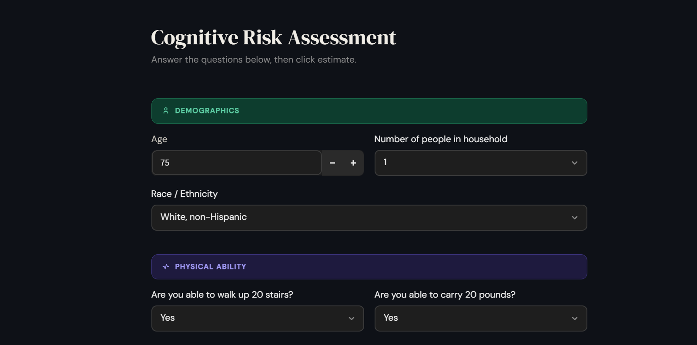
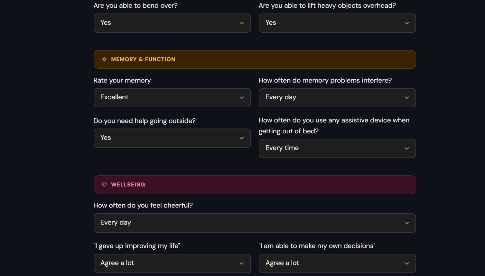
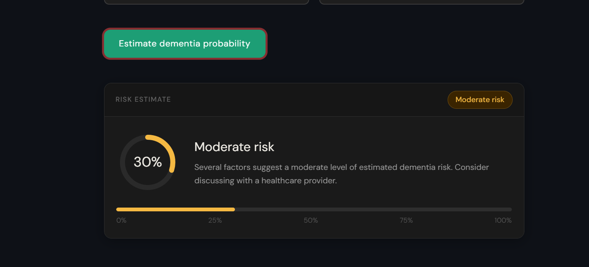

# Dementia Cognitive Risk Assessment App

A clinical screening tool developed for the School of Nursing at UNC
Wilmington to support an ongoing dementia research study. Built as a
production Streamlit application on top of a logistic regression
pipeline trained on NHATS (National Health and Aging Trends Study) data.

[](https://uncw-cognitive-risk-assessment-app.streamlit.app/)

---

## Background

This project originated as a two-semester research practicum conducted
with a team of three students and a faculty supervisor for UNCW's nursing
department. The team built and validated a logistic regression pipeline
using NHATS data to estimate dementia probability from cognitive,
demographic, functional, and wellbeing variables — with feature selection
guided by nursing faculty for clinical relevance.

Following model completion, I was individually commissioned by the nursing
department to design and deploy the model as an interactive Streamlit
application for use in their research study.

---

## Screenshots





---

## Features

- Survey-based assessment input form with human-readable labels
- Real-time dementia risk probability estimation
- Color-coded risk visualization by severity level
- Circular arc gauge for intuitive risk display
- Clean, accessible UI designed for research use

---

## Model Information

- **Algorithm:** Logistic Regression Pipeline
- **Dataset:** NHATS (National Health and Aging Trends Study)
- **Feature categories:** Demographic variables · Physical ability
  indicators · Memory and cognitive assessments · Wellbeing measures
- **Model file:** `final_log_reg_pipeline_model.pkl`

---

## Tech Stack

| Layer | Tools |
|---|---|
| Interface | Streamlit |
| Modeling | scikit-learn · pandas · Joblib |
| Data & Exploration | Databricks · NumPy |
| Language | Python |

---

## Project Structure

```text
├── streamlit/
│   ├── config.toml
├── app.py
├── final_log_reg_pipeline_model.pkl
├── requirements.txt
├── assets/
│   ├── Screenshot_input01.png
│   ├── Screenshot_input02.png
│   └── Screenshot_result.png
├── .gitignore
└── README.md
```

---

## Run Locally

For developers reviewing the project:

```bash
git clone https://github.com/farhatjoyan/Cognitive-Risk-Assessment-App
cd Cognitive-Risk-Assessment-App
pip install -r requirements.txt
streamlit run app.py
```

The live deployed version is available at the link above for end users
and research purposes.

---

## Disclaimer

This application is intended for academic, educational, and research
demonstration purposes only. It is not intended for clinical diagnosis,
medical decision-making, or patient treatment.

---

## Author

**Farhat Joyan** · MS in AI & Data Science @ UNCW
[](https://www.linkedin.com/in/farhat-joyan-7aa7132a2/)
